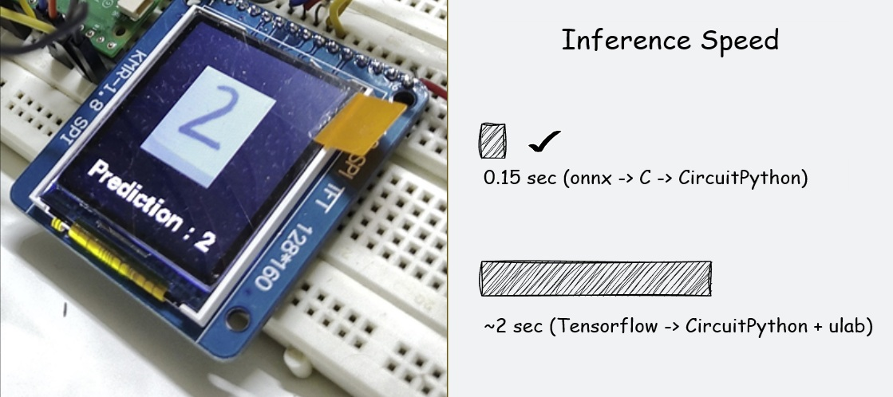

This repository contains all the files required for my article on converting TensorFlow or PyTorch models into CircuitPython modules.

It demonstrates how to integrate a small Convolutional Neural Network (CNN) into CircuitPython—a network trained to classify 30×30 handwritten digit images.

By following the steps outlined in the article, you should be able to incorporate your own trained models (provided they are sufficiently small) into a custom CircuitPython build for the board of your choice.

Link  to the article: https://ashishware.com/2026/01/10/cnn_circuitpython/ 
